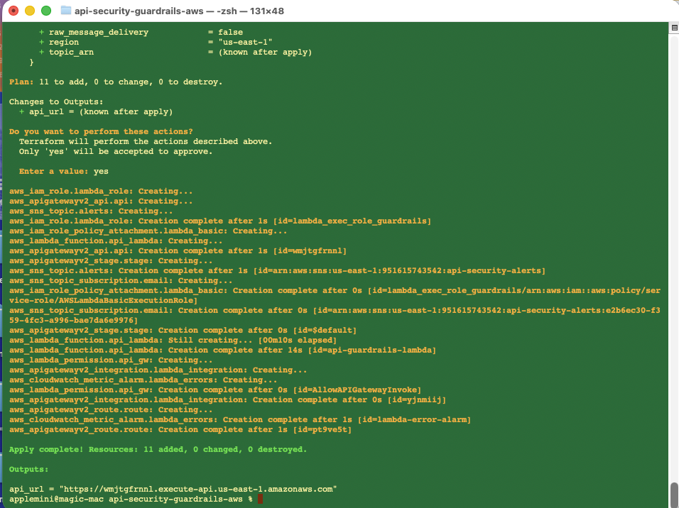
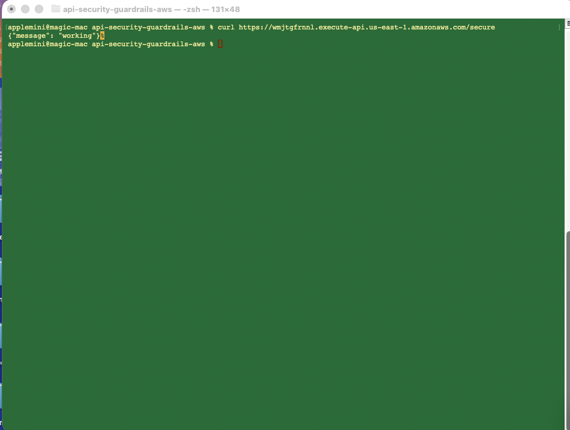
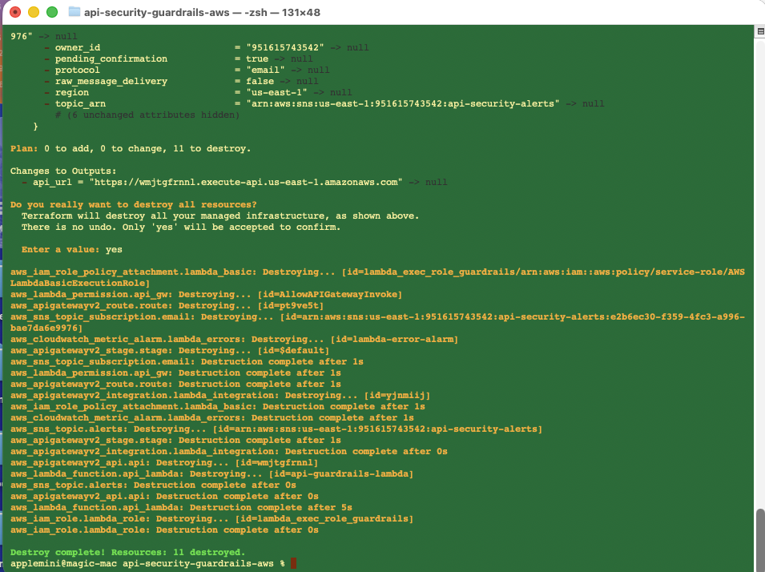

# API Security Guardrails (AWS + Terraform)

## Project Background

Modern applications rely heavily on APIs, making them a critical attack surface. Misconfigured APIs can lead to unauthorized access, data exposure, and security breaches.

This project demonstrates how to design and implement security guardrails for APIs using AWS serverless services and Terraform. The focus is on building a secure, observable, and resilient API with layered security controls.

---

## Objectives

- Build a secure API using AWS serverless architecture
- Apply layered security guardrails across multiple components
- Implement monitoring and incident response
- Use Infrastructure as Code (Terraform) for consistency and repeatability
- Simulate real-world failure scenarios and validate alerting

---

## Architecture

```
Client -> API Gateway -> Lambda -> CloudWatch Logs
            |
            v
     CloudWatch Alarm
            |
            v
           SNS
            |
            v
       Email Alert
```

---

## Security Guardrails Implemented

### 1. Access Control (API Layer)
- API Gateway enforces controlled access through the `/secure` endpoint
- Prevents direct access to backend services

### 2. Least Privilege (Compute Layer)
- Lambda function uses an IAM role with minimal permissions
- Reduces risk in case of compromise

### 3. Infrastructure Control (Deployment Layer)
- Infrastructure is defined using Terraform
- Prevents manual misconfiguration
- Ensures consistent and repeatable deployments

### 4. Monitoring and Logging (Visibility Layer)
- CloudWatch captures logs and metrics from Lambda
- Provides visibility into system behavior and API usage

### 5. Incident Response (Response Layer)
- CloudWatch Alarm detects Lambda errors
- SNS sends real-time email alerts
- Enables rapid detection and response

---

## Incident Response Workflow

```
Lambda Error -> CloudWatch Logs -> Alarm Triggered -> SNS -> Email Alert
```

---

## Testing and Validation

- Tested API using curl
- Simulated failure by introducing an error in Lambda
- Verified:
  - Error detection in CloudWatch
  - Alarm triggering
  - Email alert delivery via SNS

---

## Technologies Used

- AWS Lambda
- Amazon API Gateway
- Amazon CloudWatch
- Amazon SNS
- Terraform

---

## Deployment

```
terraform init
terraform apply
```

---

## Cleanup

```
terraform destroy
```

---

## Outcome

- Built a secure serverless API
- Implemented layered security guardrails
- Enabled monitoring and alerting
- Demonstrated real-world cloud security architecture

---

## Key Learnings

- Securing APIs using layered guardrails
- Applying least privilege principles in IAM
- Building observability with CloudWatch
- Automating detection and response using SNS
- Managing infrastructure using Terraform

---

## Future Enhancements

- Add AWS WAF for threat protection
- Implement authentication (JWT or Cognito)
- Add rate limiting and throttling
- Integrate with SIEM tools

---

Hari Sharma  
https://github.com/hsharma-cloud

---

## 📸 Screenshots

### Infrastructure Deployment (Terraform)


### API Success Response


### Infrastructure Teardown (Terraform Destroy)

